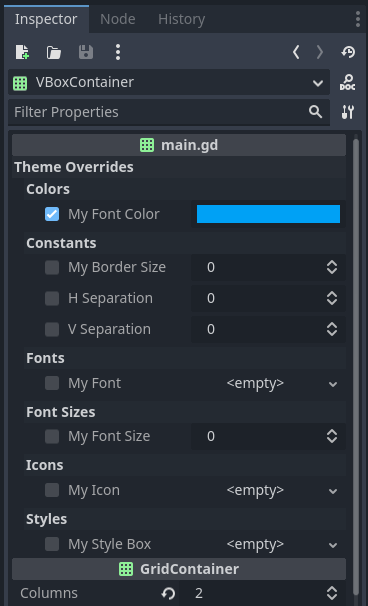
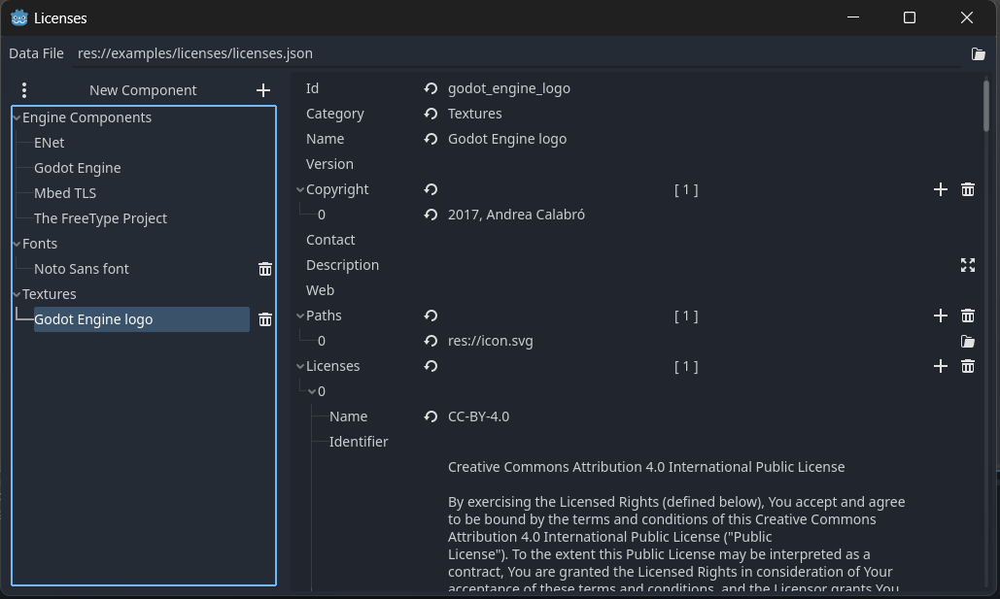
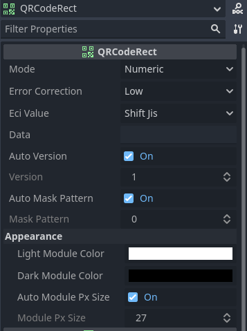

# Godot Addons

Download [here](https://github.com/kenyoni-software/godot-addons/releases/tag/latest).

## License

[MIT License](./LICENSE.md)

## Overview

### Nodes

- [AspectRatioResizeContainer](#aspectratioresizecontainer)  
  Extension of `AspectRatioContainer` to update it's own size.
- [TextureButtonColored](#texturebuttoncolored)  
  Extension of `TextureButton` with color options.
- [Logging](#logging)  
  Simple logger.
- [QR Code (beta)](#qr-code)  
  QRCodeRect and QR Code generation.

### Tools

- [Git SHA Project Setting](#git-sha-project-setting)  
  Add Git SHA as project setting.
- [Hide Private Properties](#hide-private-properties)  
  Hide private properties of instantiated child scenes.
- [Icons Patcher](#icons-patcher)  
  Patch Pictogrammers icons to white.
- [License Manager](#license-manager)  
  Manage license and copyright for third party graphics, software or libraries.

### Utility

- [Custom Theme Overrides](#custom-theme-overrides)  
  Utility to provide custom theme overrides for any node.

---

## AspectRatioResizeContainer

The `AspectRatioContainer` allows his own size to be smaller than the children, which causes neighboring UI elements to be covered.
This new node type will extend the existing `AspectRatioContainer` and update it's own minimum size based on the children.
This works except for `STRETCH_MODE_COVER`.

You are also not able to use the property `custom_minimum_size` anymore as it is used to set the minimum size.

### Compatibility

- Godot 4.1

### Example

[examples/aspect_ratio_resize_container](./examples/aspect_ratio_resize_container)

---

## Custom Theme Overrides

If you have a custom theme for your own nodes or just need custom theme overrides in your node, this plugin will give you some helping utility.

This plugin will auto register (via `class_name`) the class `CustomThemeOverrides`.

You should not use `@export` on your variables, as they will be exported with the `_get_property_list` method. Also setter and getter will not be called inside the editor.

If everything is set up, your theme override variables can be handled like every other theme override property.

### Compatibility

- Godot 4.1

### Screenshot



### Example

```gdscript
# declare the members
# DO NOT
# - use @export
# - use setter and getter, they are NOT called in the editor
# - access these variables directly
var my_font_color: Color
var my_border_size: int
var my_font: Font
var my_font_size: int
var my_icon: Texture2D
var my_style_box: StyleBox

# declare the custom theme overrides, use the member name and the theme data type.
var _theme_overrides = CustomThemeOverrides.new([
	["my_font_color", Theme.DATA_TYPE_COLOR],
	["my_border_size", Theme.DATA_TYPE_CONSTANT],
	["my_font", Theme.DATA_TYPE_FONT],
	["my_font_size", Theme.DATA_TYPE_FONT_SIZE],
	["my_icon", Theme.DATA_TYPE_ICON],
	["my_style_box", Theme.DATA_TYPE_STYLEBOX]
])

# required, if you have other properties use append_array
func _get_property_list() -> Array[Dictionary]:
	return self._theme_overrides.theme_property_list(self)

# optional: if you want to use the revert function
func _property_can_revert(property: StringName) -> bool:
	return self._theme_overrides.can_revert(property)

# optional: if you want to use the revert function, return null
func _property_get_revert(_property: StringName) -> Variant:
	return null
```

[examples/custom_theme_overrides](./examples/custom_theme_overrides)

---

## Git SHA Project Setting

Previously named `Metadata`.

Adds the project setting `application/config/git_sha`, which contains the current Git SHA.
This one is automatically set and updated when you run any scene or on exporting the project. The git_sha will **not** be kept in `project.godot` to not clutter any version control system. It will be removed from the settings on closing the Godot Editor.

### Compatibility

- Godot 4.1

### Example

[examples/metadata](./examples/metadata)

### Changelog

#### 2.0.0

Added an initial Git SHA load on opening the project.
Removed `application/config/version`, there was no need that this was part of the addon. The value can still be added manually.

---

## Hide Private Properties

Private members (names starting with an underscore) should not be exposed.

This plugin will hide exported private properties in the inspector for instantiated child scenes.

### Compatibility

- Godot 4.1

### Example

[examples/hide_private_properties](./examples/hide_private_properties)

---

## Icons Patcher

If you use Material Design icons from [Pictogrammers](https://pictogrammers.com/library/mdi/), they come without any fill color, automatically rendered black. This is not a convenient color as it makes it impossible to modulate the color. The icon patcher provides a utility to automatically patch the icons to white color.

Set the icon directory in the Project Settings under the menu `Plugins` -> `Icons Patcher`.

Then use `Project` -> `Tools` -> `Icons Patcher` to patch the icons.

### Compatibility

- Godot 4.1

### Changelog

#### 1.2.0

- Added automatic file reimporting.

---

## License Manager

Manage license and copyright for third party graphics, software or libraries.
Group them into categories, add descriptions or web links.

The data is stored inside a json file. This file is automatically added to the export, you do not need to add it yourself.

You can change the project license file either with a button at the upper right, in the license menu. Or inside the project settings under the menu `Plugins` -> `Licenses`.

### Compatibility

- Godot 4.1

### Screenshot



### Example

[examples/licenses](./examples/licenses)

### Classes & Functions

**Licenses** - [`addons/licenses/licenses.gd`](./addons/licenses/licenses.gd)

General class, providing among other things static functions to save and load licenses.

**Component** - [`addons/licenses/component.gd`](./addons/licenses/component.gd)

Component class, data wrapper for all  information regarding one license item.

**Component.License** - [`addons/licenses/component.gd`](./addons/licenses/component.gd)

License class.

---

## Logging

Simple logger. An autoload `GLogging` will be created at installation.
Logging methods support formatting, values wont be stringified if they are not logged.

Logging into a file is not supported yet. The output will be always done via print.


### Compatibility

- Godot 4.1

### Example

```
2023-07-04 15:57:16.242 [    INFO] [      root] ready and initialize GUI
2023-07-04 15:57:16.242 [    INFO] [      root] initialized logger root and other
2023-07-04 15:57:18.300 [   DEBUG] [      root] Demo Text!
2023-07-04 15:57:20.452 [    INFO] [      root] Demo Text!
2023-07-04 15:57:22.071 [ WARNING] [      root] Demo Text!
2023-07-04 15:57:24.606 [   ERROR] [      root] Demo Text!
2023-07-04 15:57:28.793 [CRITICAL] [      root] Demo Text!
2023-07-04 15:57:37.483 [    INFO] [   network] Demo Text!
2023-07-04 15:57:50.843 [    INFO] [       gui] Demo Text!
```

[examples/glogging](./examples/glogging)

### Classes & Functions

**GLogging** - [`addons/glogging/glogging.gd`](./addons/glogging/glogging.gd)

Logging base class. Provides helper methods.

- `root_logger: Logger`  
  root logger object
- `debug(message: Variant, values: Array[Variant] = []) -> void`  
  log with root logger at debug level
- `info(message: Variant, values: Array[Variant] = []) -> void`  
  log with root logger at info level
- `warning(message: Variant, values: Array[Variant] = []) -> void`  
  log with root logger at warning level, will also display a debug warning
- `error(message: Variant, values: Array[Variant] = []) -> void`  
  log with root logger at error level, will also display a debug error
- `critical(message: Variant, values: Array[Variant] = []) -> void`  
  log with root logger at critical level
- `log(level: int, message: Variant, values: Array[Variant] = []) -> void`  
  log at custom level

**GLogging.Logger** - [`addons/glogging/glogging.gd`](./addons/glogging/glogging.gd)

Logger class.
If not log level is set, the log level of the parent logger will be used.

- `create_child(module_name: String, log_level: int = LEVEL_NOTSET) -> Logger`  
  create a child logger
- `set_log_level(level: int) -> void`  
  set the log level
- `log_level() -> int`  
  get log level
- `debug(message: Variant, values: Array[Variant] = []) -> void`  
  log at debug level
- `info(message: Variant, values: Array[Variant] = []) -> void`  
  log at info level
- `warning(message: Variant, values: Array[Variant] = []) -> void`  
  log at warning level, will also display a debug warning
- `error(message: Variant, values: Array[Variant] = []) -> void`  
  log at error level, will also display a debug error
- `critical(message: Variant, values: Array[Variant] = []) -> void`  
  log at critical level
- `log(level: int, message: Variant, values: Array[Variant] = []) -> void`  
  log at custom level


---

## QR Code

> *This addon might change it's interface and available functions.  
> Please test and report any issues.*

QR Code generation either with the included `QRCodeRect` node or use the encoding result of the `QRCode` class.

### Compatibility

- Godot 4.1

### Screenshot



### Example

[examples/qr_code](./examples/qr_code)

### Classes & Functions

**QRCodeRect** - [`addons/qr_code/qr_code_rect.gd`](./addons/qr_code/qr_code_rect.gd)

`TextureRect` like node. The texture is updated by itself.

#### Properties

- `mode: QRCode.Mode`
- `error_correction: QRCode.ErrorCorrection`
- `eci_value: int`  
  Extended Channel Interpretation (ECI) Value
- `data: Variant`  
  Type varies based on the encoding mode.
- `auto_version: bool`  
  Use automatically the smallest QR Code version.
- `version: int`
- `auto_mask_pattern: bool`  
  Use automatically the best mask pattern.
- `mask_pattern: int`
- `light_module_color: Color`
- `dark_module_color: Color`
- `auto_module_px_size: bool`  
  Automatically set the module pixel size based on the size.  
  Do not use expand mode KEEP_SIZE when using it.  
  Turn this off when the QR Code changes or is resized often, as it impacts the performance quite heavily.
- `module_px_size: int`  
  Use that many pixel for one module.

**QRCode** - [`addons/qr_code/qr_code.gd`](./addons/qr_code/qr_code.gd)

QRCode class to generate QR Codes.

#### Enums

- `Mode`  
  Encoding mode enum.
  - `NUMERIC = 1`
  - `ALPHANUMERIC = 2`
  - `BYTE = 4`
  - `KANJI = 8`
- `ErrorCorrection`  
  Error correction enum.
  - `LOW = 1`
  - `MEDIUM = 0`
  - `QUARTILE = 3`
  - `HIGH = 2`
- `ECI`  
  Extended Channel Interpretation enum. Provides some values by name.

#### Properties

- `mode: Mode`
- `error_correction: ErrorCorrection`
- `eci_value: int`  
  Extended Channel Interpretation (ECI) Value
- `auto_version: bool`  
  Use automatically the smallest QR Code version.
- `version: int`
- `auto_mask_pattern: bool`  
  Use automatically the best mask pattern.
- `mask_pattern: int`

#### Methods

- `get_module_count() -> int`  
  Get the module count per side.
- `calc_min_version() -> int`  
  Get the minimal version required to encode the data.
- `generate_image(module_px_size: int = 1, light_module_color: Color = Color.WHITE, dark_module_color: Color = Color.BLACK) -> Image`  
  Generate an image. This method can be called repeatedly, as encoding will only happens once and be cached.
- `put_numeric(number: String) -> void`  
  Put a numeric text as data. Invalid characters are removed. Will change the encoding mode to `Mode.NUMERIC`.
- `put_alphanumeric(text: String) -> void`  
  Put a alphanumeric text as data. Invalid characters are removed. Will change the encoding mode to `Mode.ALPHANUMERIC`.
- `put_byte(data: PackedByteArray) -> void`  
  Put a byte data. Will change the encoding mode to `Mode.BYTE`.
- `put_numeric(number: String) -> void`  
  Put a numeric text as data. Invalid characters are removed. Will change the encoding mode to `Mode.KANJI`.
- `encode() -> PackedByteArray`  
  Get the QR Code row by row in one array. To get the row size use `get_module_count`.

**ShiftJIS** - [`addons/qr_code/shift_jis.gd`](./addons/qr_code/shift_jis.gd)

Shift JIS encoding utility.

### Functions

- `static func to_shift_jis_2004_buffer(text: String) -> PackedByteArray`
- `static func get_string_from_jis_2004(arr: PackedByteArray) -> String`
- `static func to_jis_8_buffer(text: String) -> PackedByteArray`
- `static func get_string_from_jis_8(arr: PackedByteArray) -> String`

---

## TextureButtonColored

Let you apply the icon color theme properties for the texture button. Uses `self_modulate`.

### Compatibility

- Godot 4.1

### Example

[examples/texture_button_colored](./examples/texture_button_colored)
