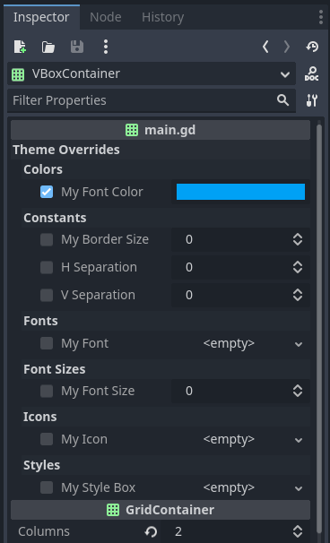

# Custom Theme Overrides

Utility to make custom theme overrides for any node possible.

Registers (via `class_name`) the class `CustomThemeOverrides`.

The custom theme override variables can be handled like every other theme override property.

## Compatibility

| Godot | Version |
|-------|---------|
| 4.3   | all     |
| 4.2   | all     |

## Screenshot



## Example

{{ kny:source "/examples/custom_theme_overrides/" }}

```gdscript
# declare the members
# DO NOT
# - use @export
# - use setter and getter, they are NOT called in the editor
# - access these variables directly
var my_font_color: Color
var my_border_size: int
var my_font: Font
var my_font_size: int
var my_icon: Texture2D
var my_style_box: StyleBox

# declare the custom theme overrides, use the member name and the theme data type.
var _theme_overrides = CustomThemeOverrides.new([
	["my_font_color", Theme.DATA_TYPE_COLOR],
	["my_border_size", Theme.DATA_TYPE_CONSTANT],
	["my_font", Theme.DATA_TYPE_FONT],
	["my_font_size", Theme.DATA_TYPE_FONT_SIZE],
	["my_icon", Theme.DATA_TYPE_ICON],
	["my_style_box", Theme.DATA_TYPE_STYLEBOX]
])

# required, if you have other properties use append_array
func _get_property_list() -> Array[Dictionary]:
	return self._theme_overrides.theme_property_list(self)

# optional: if you want to use the revert function
func _property_can_revert(property: StringName) -> bool:
	return self._theme_overrides.can_revert(property)

# optional: if you want to use the revert function, return null
func _property_get_revert(_property: StringName) -> Variant:
	return null
```

!!! warning

    You should not use `@export` on your custom theme variables, as they will be exported with the `_get_property_list` method.

    Setter and getter of the variables will not be called inside the editor.

## Changelog

### 1.1.0

- Require Godot 4.2
- Add more values to plugin.cfg
- Add static typing in for loops