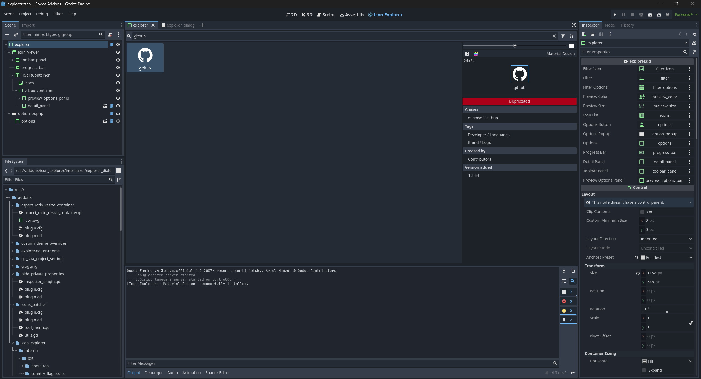
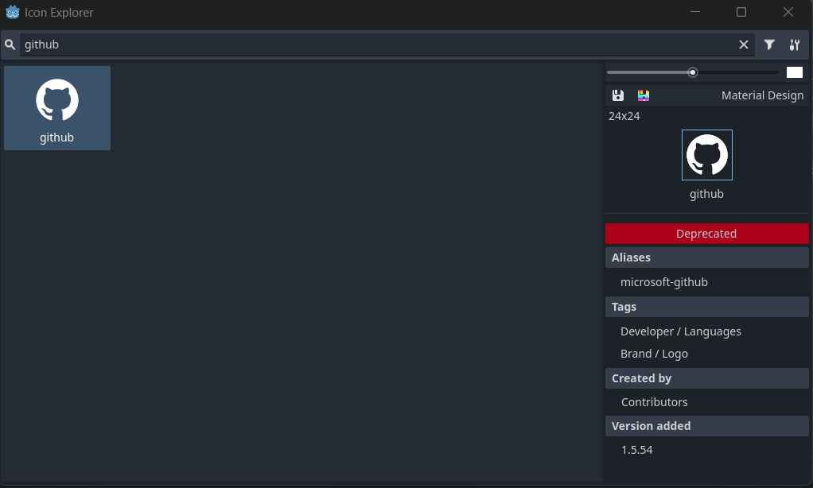

# Icon Explorer

Browse and save icons from popular icon collections.

Install or update them via the options menu in the right upper corner. This can take several minutes.

You can remove the main screen button in the options.

**Available collections**

- [Bootstrap Icons](https://github.com/twbs/icons) {{ kny:badge-version 1.0.0 }}
- [country-flag-icons](https://gitlab.com/catamphetamine/country-flag-icons) {{ kny:badge-version 1.2.0 }}
- [Font Awesome 6](https://github.com/FortAwesome/Font-Awesome) {{ kny:badge-version 1.0.0 }}
- [Material Design](https://github.com/Templarian/MaterialDesign-SVG) {{ kny:badge-version 1.0.0 }}
- [Simple Icons](https://github.com/simple-icons/simple-icons) {{ kny:badge-version 1.0.0 }}
- [tabler Icons](https://github.com/tabler/tabler-icons) {{ kny:badge-version 1.0.0 }}

!!! note

    Downloaded data is saved into `.godot/cache/icon_explorer` to avoid importing it.

## Compatibility

| Godot | Version  |
|-------|----------|
| 4.3   | >= 1.2.0 |
| 4.2   | <= 1.1.0 |

## Screenshot

In Main screen:

As popup:

## Changelog

### 1.2.0

- Require Godot 4.3
- Make use of @export for custom Nodes
- Improve loading visualization
- Add Icons to Main Screen (this is optional and can be turned off)
- Add check for updates button
- Remove editor toast notification (access was removed)
- Focus filter input on opening

### 1.1.0

- Use editor toast notification

### 1.0.0

- Add icon explorer
