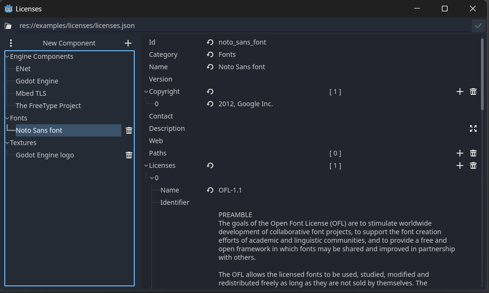

# License Manager

Manage license and copyright for third party graphics, software or libraries.
Group them into categories, add descriptions or web links.

You will find the License Manager under `Project -> Tools -> Licenses...`.

The data is stored inside a json file. This file is automatically added to the export, you do not need to add it
yourself. If you provide license files instead of a text, they are also exported.

If paths are added to license data, it will be automatically adjusted if you rename a file or folder inside the editor.

You can change the project license file either with a button at the upper right, in the license menu. Or modify this and the indentation of the license file at the project settings under the menu `Plugins` -> `Licenses`.

[**Download**](https://github.com/kenyoni-software/godot-addons/releases)

## Compatibility

| Godot | Version       |
| ----- | ------------- |
| 4.4   | >= 1.9.0      |
| 4.3   | 1.8.0 - 1.8.3 |
| 4.2   | 1.6.0 - 1.7.8 |
| 4.1   | <= 1.5.0      |

## Screenshot

## Example

{{ kny:source "/examples/licenses/" }}

## Interface

### Licenses

{{ kny:source "/addons/licenses/licenses.gd" "res://addons/licenses/licenses.gd" }}

Providing static utility and static functions to save and load licenses.

#### Methods

{{ kny:godot bool }} compare_components_ascending ( [Component](#component) lhs, [Component](#component) rhs ) static {: .kny-mono-font }
:     Compare components ascending.

[Component](#component) get_engine_component ( {{ kny:godot String }} name ) static {: .kny-mono-font }
:     Get engine component by name.

{{ kny:godot Array }}[[Component](#component)] get_engine_components () static {: .kny-mono-font }
:     Get all engine components.

{{ kny:godot Array }}[[Component](#component)] get_required_engine_components () static {: .kny-mono-font }
:     Get engine components which are marked as required to mention.

[Error](https://docs.godotengine.org/en/stable/classes/class_%40globalscope.html#enum-globalscope-error) save ( {{ kny:godot Array }}[[Component](#component)] components, {{ kny:godot String }} file_path, {{ kny:godot String }} indent = "" ) -> static {: .kny-mono-font }
:     Save array of components to file.

[LoadResult](#licensesloadresult) load ( {{ kny:godot String }} file_path ) static {: .kny-mono-font }
:     Load licenses from file.

void set_license_data_filepath ( {{ kny:godot String }} path ) static {: .kny-mono-font }
:     Set the project license data path.

{{ kny:godot String }} get_license_data_filepath () static {: .kny-mono-font }
:     Returns the project license data path.

### Licenses.LoadResult

{{ kny:badge extends RefCounted --left-bg }}

{{ kny:source "/addons/licenses/licenses.gd" "res://addons/licenses/licenses.gd" }}

Loading result returned when loading a licenses file.

#### Properties

| Name                           | Type                                                               | Description                        |
| ------------------------------ | ------------------------------------------------------------------ | ---------------------------------- |
| components {: .kny-mono-font } | {{ kny:godot Array }}[[Component](#component)] {: .kny-mono-font } | Components.                        |
| err_msg {: .kny-mono-font }    | {{ kny:godot String }}                                             | Error message when loading failed. |

### Component

{{ kny:badge extends RefCounted --left-bg }}

{{ kny:source "/addons/licenses/component.gd" "res://addons/licenses/component.gd" }}

Component class, data wrapper for all information regarding one license item.

#### Properties

| Name                            | Type                                                                    | Description                                                                |
| ------------------------------- | ----------------------------------------------------------------------- | -------------------------------------------------------------------------- |
| id {: .kny-mono-font }          | {{ kny:godot String }}                                                  | Identifier.                                                                |
| category {: .kny-mono-font }    | {{ kny:godot String }}                                                  | Use to structure the licenses to top categories. E.g. Textures, Fonts, ... |
| name {: .kny-mono-font }        | {{ kny:godot String }}                                                  | Name of the software or component.                                         |
| version {: .kny-mono-font }     | {{ kny:godot String }}                                                  | Version of the software or component.                                      |
| copyright {: .kny-mono-font }   | {{ kny:godot PackedStringArray }}                                       | Copyrights.                                                                |
| contact {: .kny-mono-font }     | {{ kny:godot String }}                                                  | Contact of developer.                                                      |
| description {: .kny-mono-font } | {{ kny:godot String }}                                                  | Additional description.                                                    |
| web {: .kny-mono-font }         | {{ kny:godot String }}                                                  | Web url to project page.                                                   |
| paths {: .kny-mono-font }       | {{ kny:godot PackedStringArray }}                                       | Path to affected files or directories.                                     |
| licenses {: .kny-mono-font }    | {{ kny:godot Array }}[[License](#componentlicense)] {: .kny-mono-font } | Licenses.                                                                  |

#### Methods

{{ kny:godot PackedStringArray }} get_warnings () const {: .kny-mono-font }
:     Get warnings regarding this component, e.g. missing license.

{{ kny:godot Dictionary }} serialize () const {: .kny-mono-font }
:     Serialize to dictionary.

[Component](#component) deserialize ( {{ kny:godot Dictionary }} data ) {: .kny-mono-font }
:     Load values from dictionary.

[Component](#component) duplicate () const {: .kny-mono-font }
:     Returns a duplicate of itself.

### Component.License

{{ kny:badge extends RefCounted --left-bg }}

{{ kny:source "/addons/licenses/licenses.gd" "res://addons/licenses/licenses.gd" }}

License class.

#### Properties

| Name                           | Type                   | Description                                                                               |
| ------------------------------ | ---------------------- | ----------------------------------------------------------------------------------------- |
| name {: .kny-mono-font }       | {{ kny:godot String }} | Full name.                                                                                |
| identifier {: .kny-mono-font } | {{ kny:godot String }} | Shortcode for this license.                                                               |
| text {: .kny-mono-font }       | {{ kny:godot String }} | License text.                                                                             |
| file {: .kny-mono-font }       | {{ kny:godot String }} | License file. Will load the license text from this file automatically if `text` is empty. |
| web {: .kny-mono-font }        | {{ kny:godot String }} | Web present of the license.                                                               |

#### Methods

{{ kny:godot String }} get_license_text () const {: .kny-mono-font }
:     Either returns the license text or loads the text from file or a message that the text could not be loaded.

{{ kny:godot String }} serialize () const {: .kny-mono-font }
:     Serialize to dictionary.

[License](#componentlicense) deserialize ( {{ kny:godot Dictionary }} data ) {: .kny-mono-font }
:     Load values from dictionary.

[License](#componentlicense) duplicate () const {: .kny-mono-font }
:     Returns a duplicate of itself.

## Changelog

### 1.9.0

- Require Godot 4.4
- Add UIDs for Godot 4.4
- Add right click context menu to filesystem, to show the license of a file or folder
- Internal editor restructure
- Deprecated `Licenses.DATA_FILE` use `Licenses.CFG_KEY_DATA_FILE` instead
- Change `Licenses.save` signature it is now returning `Error` instead of `int`

### 1.8.3

- Fix deleting the correct item when pressing the delete button

### 1.8.2

- Add option to configure the license file indentation

### 1.8.1

- Fix crash when running a project exported in release mode

### 1.8.0

- Require Godot 4.3
- Make use of @export for custom Nodes

### 1.7.8

- Detect movement of licenses json file

### 1.7.7

- Use absolute paths in preloads

### 1.7.6

- Fix scene id
- Code improvement

### 1.7.5

- Fix license file existing check

### 1.7.4

- Fix show engine component

### 1.7.3

- Fix component selection and right click menu

### 1.7.2

- Fix current selection of component on popup
- Change drag and drop behavior

### 1.7.1

- Add adjusting filepath of license files on moving
- Add more warnings
- Fix reloading UI if something was changed on moving

### 1.7.0

- Add renaming of paths when a file or folder gets renamed inside the editor
- Add right click menu to duplicate or delete items

### 1.6.1

- Workaround show engine components, calling static function is bugged

### 1.6.0

- Require Godot 4.2
- Add more values to plugin.cfg
- Add static typing in for loops
- Use static sorting function as lambda

### 1.5.0

- Removed overriden engine methods
- Creating a plugin component will now add the plugin path to paths
- Fix dragging/ double click crash
- Fix overriding project license file if another license file is loaded
- Add warning tooltip if a component paths does not exist
