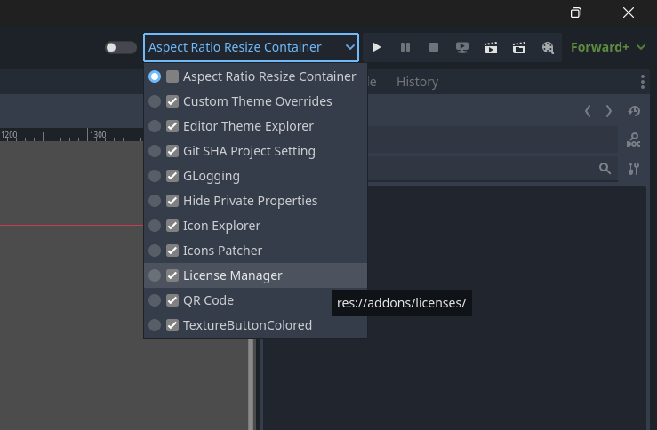

# Plugin Reloader

Enable or disable plugins from within the editor main screen.

## Compatibility

| Godot | Version  |
|-------|----------|
| 4.3   | >= 1.0.0 |
| 4.2   | >= 1.0.0 |

## Screenshot

## Changelog

### 1.0.0

- Initial release
