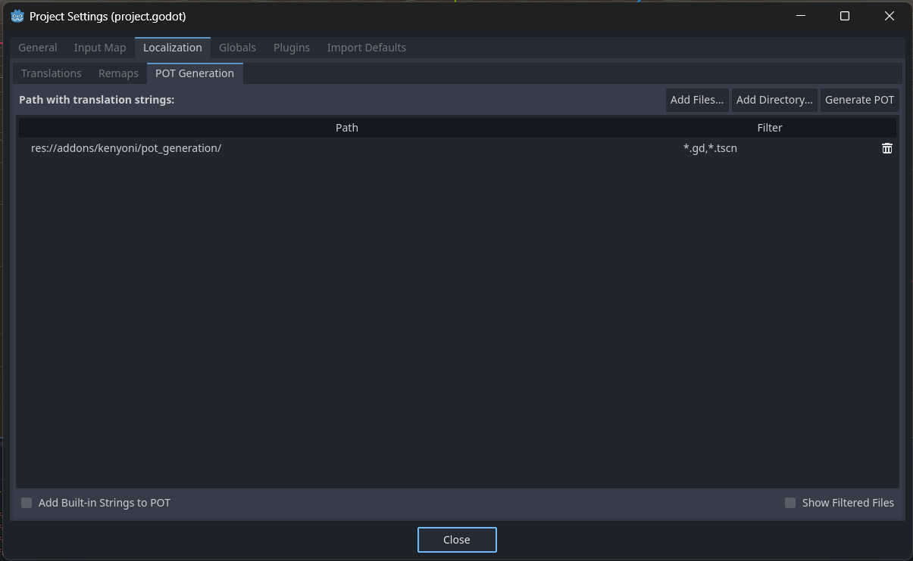

# POT Generation

Download: [**GitHub**](https://github.com/kenyoni-software/godot-addons/releases)

POT generation with files, directories and filters.

The filters are applied as glob patterns, for example:

- `*.gd` to include all GDScript files
- `*.tscn` to include all scene files

You can split multiple patterns with commas, for example: `*.gd,*.tscn`.

## Compatibility

| Godot | Version        |
| ----- | -------------- |
| 4.7   | >= 1.0.0       |
| 4.6   | >= 1.0.0       |
| 4.5   | 1.0.0  - 1.1.1 |
| 4.4   | 1.0.0  - 1.1.1 |
| 4.3   | 1.0.0  - 1.1.1 |
| 4.2   | 1.0.0  - 1.1.1 |

## Screenshot

## Changelog

### 1.2.0

- Require Godot 4.6
- Upgrade scenes to Godot 4.6
- Improve ProjectSettings changed handling

### 1.1.1

- Fix: Refresh tree when filter changed

### 1.1.0

- Keep translation files from the Godot POT generation, if the plugin has not yet any configuration
- Disable filter input on files

### 1.0.0

- Initial release
