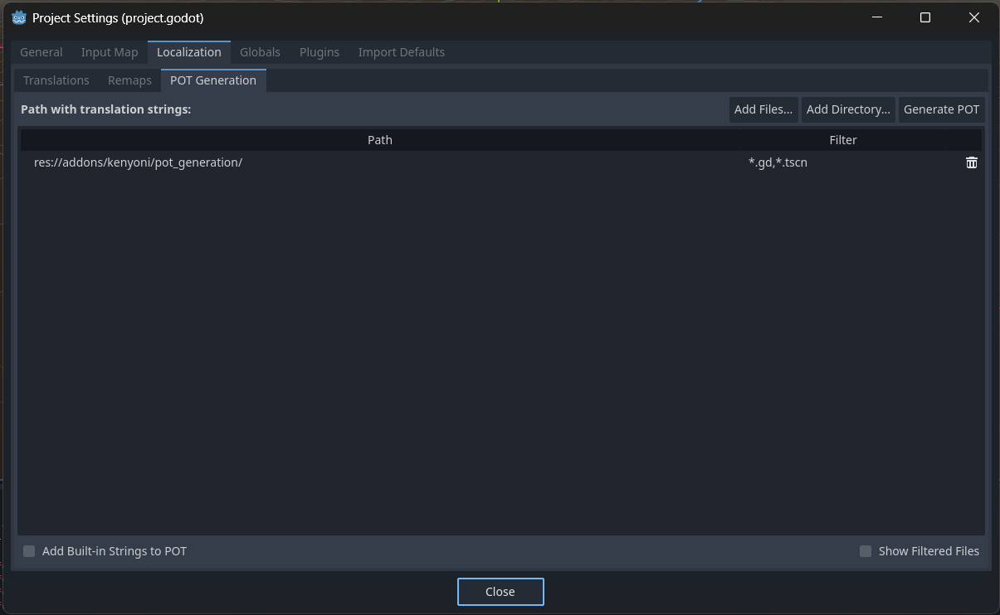

# POT Generation

POT generation with files, directories and filters.

[**Download**](https://github.com/kenyoni-software/godot-addons/releases)

## Compatibility

| Godot | Version  |
|-------|----------|
| 4.4   | >= 1.0.0 |
| 4.3   | >= 1.0.0 |
| 4.2   | >= 1.0.0 |

## Screenshot

## Changelog

### 1.1.0

- Keep translation files from the Godot POT generation, if the plugin has not yet any configuration
- Disable filter input on files

### 1.0.0

- Initial release
