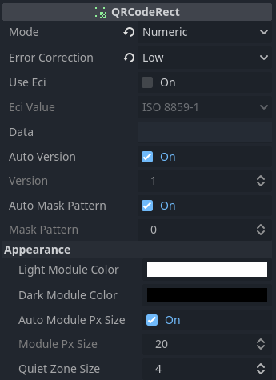

# QR Code

{{ kny:badge-download "text" }}

QR Code generation either with the included `QRCodeRect` node or use the encoding result of the `QRCode` class.

## Compatibility

| Godot | Version  |
| ----- | -------- |
| 4.3   | >= 1.1.0 |
| 4.2   | >= 1.1.0 |
| 4.1   | <= 1.0.0 |

## Screenshot

## Example

{{ kny:source "/examples/qr_code/" }}

## Interface

### QRCodeRect

{{ kny:badge extends TextureRect --left-bg }}

{{ kny:source "/addons/qr_code/qr_code_rect.gd" "res://addons/qr_code/qr_code_rect.gd" }}

`TextureRect` like node. The texture is updated by itself.
When using byte encoding you can also pass strings for specific ECI values (ISO 8859-1, Shift JIS, UTF-8, UTF-16, US ASCII), the input string will be automatically converted to an byte array.

#### Properties

| Name                                    | Type                                             | Description                                                                                                                                                                                                              |
| --------------------------------------- | ------------------------------------------------ | ------------------------------------------------------------------------------------------------------------------------------------------------------------------------------------------------------------------------ |
| mode {: .kny-mono-font }                | [QRCode.Mode](#qrcodemode)                       | QR Code mode                                                                                                                                                                                                             |
| error_correction {: .kny-mono-font }    | [QRCode.ErrorCorrection](#qrcodeerrorcorrection) | Error correction value.                                                                                                                                                                                                  |
| use_eci {: .kny-mono-font }             | {{ kny:godot String }}                           | Use Extended Channel Interpretation (ECI)                                                                                                                                                                                |
| eci_value {: .kny-mono-font }           | {{ kny:godot String }}                           | Extended Channel Interpretation (ECI) Value                                                                                                                                                                              |
| data {: .kny-mono-font }                | {{ kny:godot Variant }}                          | Type varies based on the encoding mode.                                                                                                                                                                                  |
| auto_version {: .kny-mono-font }        | {{ kny:godot bool }}                             | Use automatically the smallest QR Code version.                                                                                                                                                                          |
| version {: .kny-mono-font }             | {{ kny:godot int }}                              | QR Code version (size).                                                                                                                                                                                                  |
| auto_mask_pattern {: .kny-mono-font }   | {{ kny:godot bool }}                             | Use automatically the best mask pattern.                                                                                                                                                                                 |
| mask_pattern {: .kny-mono-font }        | {{ kny:godot int }}                              | QR Code mask pattern.                                                                                                                                                                                                    |
| light_module_color {: .kny-mono-font }  | {{ kny:godot Color }}                            | Color of the light modules.                                                                                                                                                                                              |
| dark_module_color {: .kny-mono-font }   | {{ kny:godot Color }}                            | Color of the dark modules.                                                                                                                                                                                               |
| auto_module_px_size {: .kny-mono-font } | {{ kny:godot bool }}                             | Automatically set the module pixel size based on the size. Do not use expand mode `KEEP_SIZE` when using it. Turn this off when the QR Code changes or is resized often, as it impacts the performance quite heavily. |
| module_px_size {: .kny-mono-font }      | {{ kny:godot int }}                              | Use that many pixel for one module.                                                                                                                                                                                      |
| quiet_zone_size {: .kny-mono-font }     | {{ kny:godot int }}                              | Use that many modules for the quiet zone. A value of 4 is recommended.                                                                                                                                                   |

### QRCode

{{ kny:badge extends RefCounted --left-bg }}

{{ kny:source "/addons/qr_code/qr_code.gd" "res://addons/qr_code/qr_code.gd" }}

QRCode class to generate QR Codes.

#### Properties

| Name                                  | Type                                                                 | Description                                     |
| ------------------------------------- | -------------------------------------------------------------------- | ----------------------------------------------- |
| mode {: .kny-mono-font }              | [QRCode.Mode](#qrcodemode) {: .kny-mono-font }                       | QR Code mode.                                   |
| error_correction {: .kny-mono-font }  | [QRCode.ErrorCorrection](#qrcodeerrorcorrection) {: .kny-mono-font } | Error correction value.                         |
| use_eci {: .kny-mono-font }           | {{ kny:godot String }}                                               | Use Extended Channel Interpretation (ECI)       |
| eci_value {: .kny-mono-font }         | {{ kny:godot String }}                                               | Extended Channel Interpretation (ECI) Value     |
| auto_version {: .kny-mono-font }      | {{ kny:godot bool }}                                                 | Use automatically the smallest QR Code version. |
| version {: .kny-mono-font }           | {{ kny:godot int }}                                                  | QR Code version (size).                         |
| auto_mask_pattern {: .kny-mono-font } | {{ kny:godot bool }}                                                 | Use automatically the best mask pattern.        |
| mask_pattern {: .kny-mono-font }      | {{ kny:godot int }}                                                  | QR Code mask pattern.                           |

#### Methods

{{ kny:godot int }} get_module_count () const {: .kny-mono-font }
:     Return the module count per side.

{{ kny:godot int }} calc_min_version () const {: .kny-mono-font }
:     Return the minimal version required to encode the data.

{{ kny:godot Image }} generate_image ( {{ kny:godot int }} module_px_size=1, {{ kny:godot Color }} light_module_color=Color.WHITE, {{ kny:godot Color }} dark_module_color=Color.BLACK ) {: .kny-mono-font }
:     Generate an image. This method can be called repeatedly, as encoding will only happens once and the result is cached.

void put_numeric ( {{ kny:godot String }} number ) {: .kny-mono-font }
:     Put a numeric text. Invalid characters are removed. Will change the encoding mode to `Mode.NUMERIC`.

void put_alphanumeric ( {{ kny:godot String }} text ) {: .kny-mono-font }
:     Put a alphanumeric text. Invalid characters are removed. Will change the encoding mode to `Mode.ALPHANUMERIC`.

void put_byte ( {{ kny:godot PackedByteArray }} data ) {: .kny-mono-font }
:     Put a bytes. Will change the encoding mode to `Mode.BYTE`.

void put_kanji ( {{ kny:godot String }} data ) {: .kny-mono-font }
:     Put a kanji text. Invalid characters are removed. Will change the encoding mode to `Mode.KANJI`.

{{ kny:godot PackedByteArray }} encode () {: .kny-mono-font }
:     Get the QR Code row by row in one array. To get the row size use `get_module_count`.

### QRCode.Mode

{{ kny:source "/addons/qr_code/qr_code.gd" "res://addons/qr_code/qr_code.gd" }}

Encoding mode enum.

| Name                             | Value |
| -------------------------------- | ----- |
| NUMERIC {: .kny-mono-font }      | 1     |
| ALPHANUMERIC {: .kny-mono-font } | 2     |
| BYTE {: .kny-mono-font }         | 4     |
| KANJI {: .kny-mono-font }        | 8     |

### QRCode.ErrorCorrection

{{ kny:source "/addons/qr_code/qr_code.gd" "res://addons/qr_code/qr_code.gd" }}

Error correction enum.

| Name                         | Value |
| ---------------------------- | ----- |
| LOW {: .kny-mono-font }      | 1     |
| MEDIUM {: .kny-mono-font }   | 0     |
| QUARTILE {: .kny-mono-font } | 3     |
| HIGH {: .kny-mono-font }     | 2     |

### QRCode.ECI

{{ kny:source "/addons/qr_code/qr_code.gd" "res://addons/qr_code/qr_code.gd" }}

ECI values. See source code for available values.

### ShiftJIS

{{ kny:source "/addons/qr_code/shift_jis.gd" "res://addons/qr_code/shift_jis.gd" }}

Shift JIS encoding utility.

#### Methods

{{ kny:godot PackedByteArray }} to_shift_jis_2004_buffer ( {{ kny:godot String }} text ) -> PackedByteArray` static {: .kny-mono-font }
:     Convert text to Shift JIS 2004 encoded bytes. Returns u16 int array. Unknown characters are skipped.

{{ kny:godot String }} get_string_from_shift_jis_2004 ( {{ kny:godot PackedByteArray }} arr ) static {: .kny-mono-font }
:     Get text from Shift JIS 2004 encoded bytes. Requires an u16 int array. Unknown characters are skipped.

{{ kny:godot PackedByteArray }} to_jis_8_buffer ( {{ kny:godot String }} text ) static {: .kny-mono-font }
:     Convert text to JIS 8 encoded bytes. Returns u8 int array. Unknown characters are skipped.

{{ kny:godot String }} get_string_from_jis_8 ( {{ kny:godot PackedByteArray }} arr ) static {: .kny-mono-font }
:     Get text from JIS 8 encoded bytes. Requires an u8 int array. Unknown characters are skipped.

## Changelog

### 1.1.3

- Code improvements

### 1.1.2

- Use absolute paths in preloads

### 1.1.1

- Code optimizing

### 1.1.0

- Require Godot 4.2
- Add more values to plugin.cfg
- Add static typing in for loops

### 1.0.0

- Renamed `get_string_from_jis_2004` to `get_string_from_shift_jis_2004`

### 0.3.1

- Improve inspector properties
- Improve input handling of byte data based on ECI usage

### 0.3.0

- Make ECI value optional

### 0.2.0

- Added quiet zone size property
